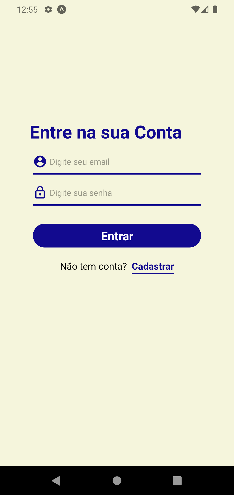
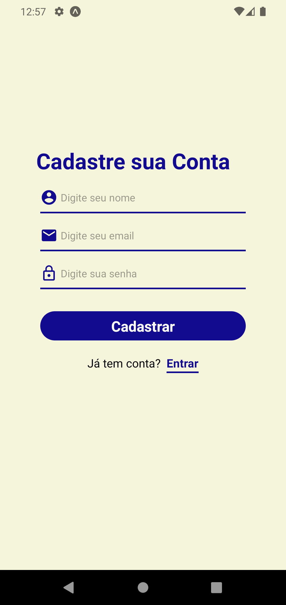
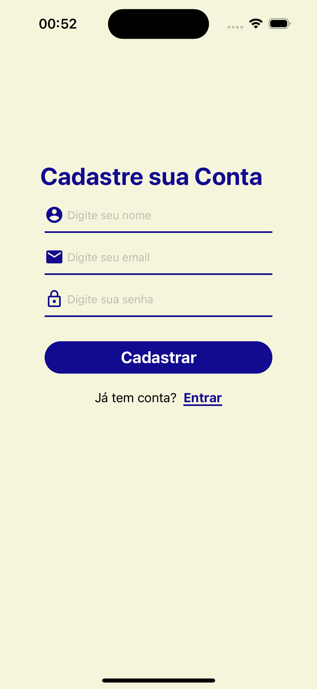
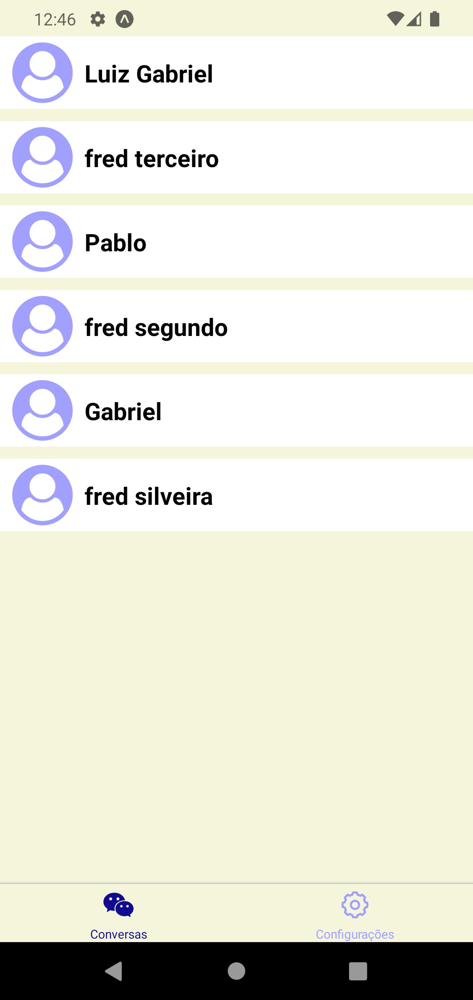
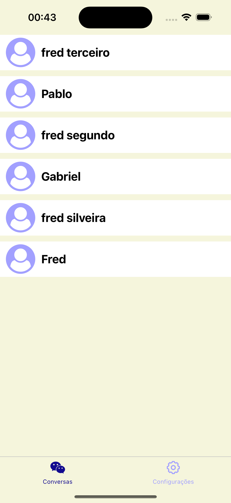
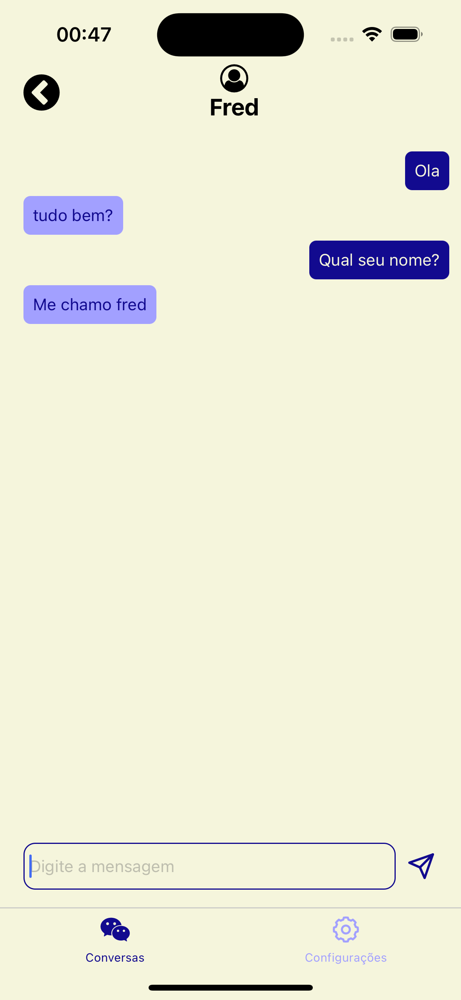
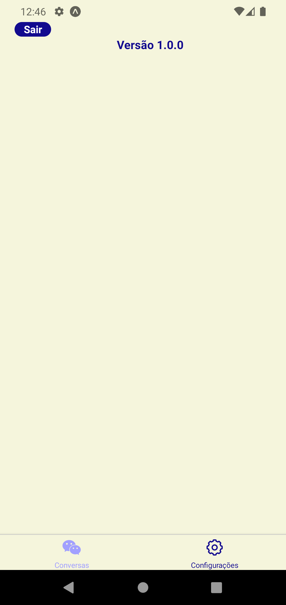
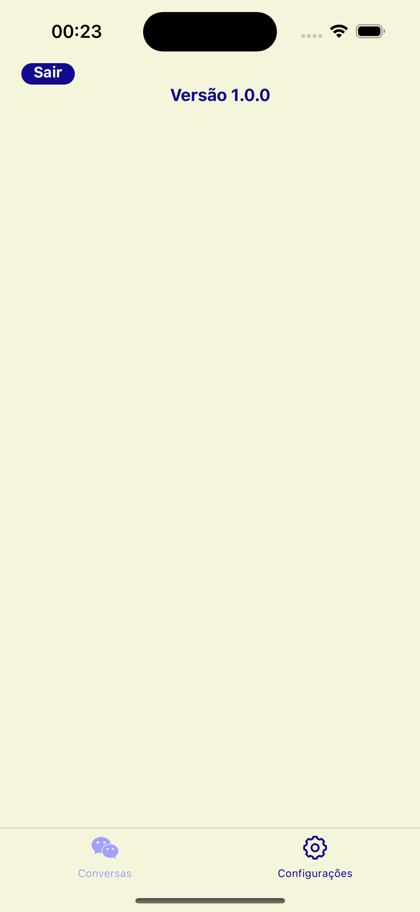

# Chat Realtime

### 🏛️ O que é?
Chat em tempo real

### 🛠 Tecnologias

- Typescript
- Javascript
- React Native
- Firebase
- Async Storage
- React Navigation(Stack e Tab)
- Styled-components
- dotenv

### 🖥️ Funcionalidades

- Criar Usuário
- Logar
- Deslogar
- Conversar em tempo real

### ▶️  Executar
1. Clonar Repositório
```
 git clone  https://github.com/Luizrebelatto/app-chat-realtime
```

2. Instalar Dependência
```
 yarn install
```
 ou
```
 npm i
```

3. Executar Emulador
```

 npx expo start --clear

```

4. Crie o arquivo .env na raiz do projeto com esses dados, crie um projeto no firebase para obter esses dados:
```
API_KEY=
AUTH_DOMAIN=
PROJECT_ID=
STORAGE_BUCKET=
MESSAGING_SENDER_ID=
APP_ID=
MEASUREMENT_ID=
```

### 📱 App Screenshots

|     Telas           |              Android                       |              IOS                          |                           
| :------------: | :----------------------------------------: | :---------------------------------------: |
| SignIn |  |  |
| SignUp |  |  |
| Talks  |   |   |
| Talk   |     |       |
| Config |    |     | 
